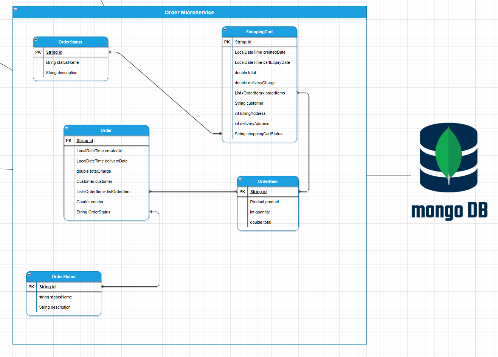

# Online Store Project Documentation - Version 3 - Microsservices Revision Implementation

## Overview and Purpose

The application is an Online Store that that allows Customers to register and make purchases, employees to manage the ordering process and perform some back of house operations - such as supplier management and supply ordering.

## Technologies

The application is developed in Java and use the following supporting technologies:

- Spring Boot
- Spring Data
- Spring BWeb
- SQL Database (PostgreSQL)
- NoSQL Database (Redis and MongoDB)
- Rest API services
- Will use a microservice design approach

## Microservices Domains

The application is divided into 6 microservices:

1. Customer - this service is for managing information about the customers
2. Product - this service is for managing all the information related to product - such as the product information, product categories.
3. Order - this service is for managing all the information about the orders and shopping cart.
4. Supplier - this service is for managing all the information about supply management and suppliers
5. Employee - this service is for managing all the information related to employee management
6. Courier - this service is for managing all the the information related to courier management.

## 

#### Customer-Service

The customer service at the moment only has 1 class for all the customer information. [Customer](#customer) and the information is stored in a a database on a PostgreSQL server.

## 

There is a problem with this approach as it limits the customer to 1 deliveryAddress and 1 billingAddress, but in the real word implementation a customer could have many billing and delivery addresses, for example a customer wants to purpose a product for a family member and needs to change the billing and delivery address. In this example the customer will change their addresses for all orders.

The next update the address information will be extracted into another class called Address, and the information will be stored in an Redis database.

## 

#### Product-Service

The product service contains 4 classes:

- [Category](#category)
- [Product](#product)
- [ProductImage](#productimage)
- [Review](#review)

These are all related to the management of products, and the information is stored in database stored on PostgreSQL.

The productImage class will stored the image as binary data in the database, this makes is very portable and can be streamed by any frontend technology. It also has the benefit the information can replicated with the database as needed, and there is no need for additional infrastructure and management overhead that comes with managing image files.

## 

#### Order-Service

The order service is service contains 5 classes which are related to the ordering process. The information is stored in a MongoDB database

- [Order](#order)
- [OrderItem](#orderitem)
- [OrderStatus](#orderstatus)
- [ShoppingCartStatus](#shoppingcartstatus)
- [ShoppingCart](#shoppingcart)

## 

#### Supplier-Service

The supplier service has 6 classes associated with supplier and supply management. The information is stored in stored in a database in PostgreSQL.

- [Supplier](#supplier)
- [SupplierEmployeeContact](#supplieremployeecontact)
- [SupplierOrderStatus](#supplierorderstatus)
- [SupplyOrder](#supplierorders)

## 

However at the next update the classes related to the orders will be moved to a MongoDB as the having a SQL relationship between Order and Order Item offers no advantage.

## 

#### Employee-Service

The employee service contains 3 classes, related to Employee management which includes departments and UserTpyes which in a future version will be used to determine the level of access in the system. The information is stored in a database in PostgreSQL.

- [Department](#department)
- [Employee](#employee)
- [UserTypes](#usertype)

## 

#### Courier-Service

Today the Courier service only has 1 class and that is for managing information about the courier. The information is stored in a database in PostgreSQL.

- [Courier](#Courier)

## 

# Supporting Technology

The next update will integrate Kafka messaging the scenarios that will be covered:

1. When an order is completed, a message will be sent to the product service to reduce the quantity of the products in the order.
2. When a supply order is "received", a message will be send to product service to increase the quantities for the products on that supply order.

The next update will integrate Spring Security into the environment, this will be used to secure access to REST API, and also be used to encrypt the passwords in the Customer and Employee services.

# Demo - Postman Queries:

The demo will not include the full docker implementation because my laptop is does not have enough power to run multiple instances of the the databases containers. I will have 1 database instance of PostgreSQl with multiple databases.

### Product:

I can add a new Product by send the following body of information

- POST - add new product

I can update some element in the product

- PATCH - update some elements of a product

```JSON

{
    "detailedDescription" : "The new iPhone 14 Pro Max",
    "warranty" : "3 years",
}

```

- GET - so 3 queries in action

List all the Products in a Category

/api/v1/products/{categoryID}/products

List - the Images for a product

/api/v1/products/{productID}/images

List all the products that are from a specific brand:

/api/v1/products/?brand=Chanel

### ProductImage

- POST - add new productImage

- Query - List all Images
- Query - List All Images by name

### Order

Add a new order

- GWT - return all orders
  - api/v1/order


For the next update, i will changing the controllers so that they support single REST service and all the filtering criteria is done by query parameters
